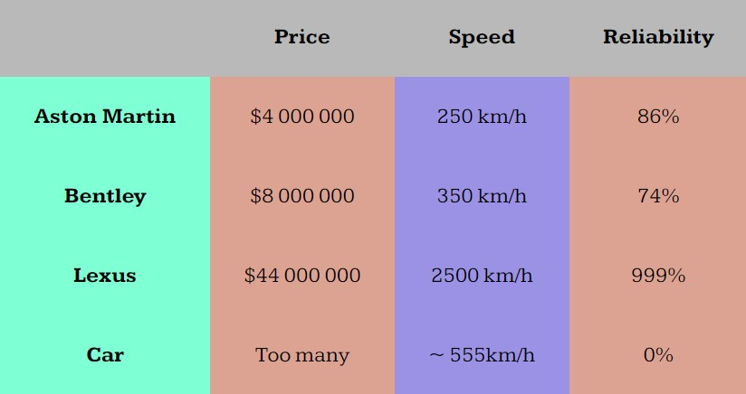

# ScriptSmith.css 
**Author:** *Vladislav Levitskii*
## Demo site
Link to **[demo](https://pslib-cz.github.io/2023-l4-web-typographic-library-VladislavLevitskii/)** site for preview.

## Description
ScriptSmith.css is a typographic library.
## Implementation
```html
<head>
    <link rel="stylesheet" href="FILEPATH">
</head>
```
**Replace FILEPATH with a link to the file, for example: href="library.css" if library.css is in the same folder**

**You can download file from the website or [here](https://github.com/pslib-cz/2023-l4-web-typographic-library-VladislavLevitskii/blob/master/docs/library.css)**
## Font
Font used in this library is called: "Kameron". You can find this font on [Google Fonts](https://fonts.google.com/). If you want to change this font, replace this with your own font:
```css
@import url('https://fonts.googleapis.com/css2?family=Kameron:wght@400;500;700&display=swap');
```
## Headings
Headings from `<h1>` to `<h6>`. Font sizes are:
* `h1`: 34px (Desktop), 24px (Mobile)
* `h2`: 30px (Desktop), 22px (Mobile)
* `h3`: 24px (Desktop), 20px (Mobile)
* `h4`: 20px (Desktop), 18px (Mobile)
* `h5`: 18px (Desktop), 16px (Mobile)
* `h5`: 16px (Desktop), 14px (Mobile)
## Text
**Main size of `<p>` is 18px for desktop and 14px for mobile**
- `<b>` for **bold** text
- `<i>` for *italic* text
- `<u>` for underlined text
- `<del>` for ~~deleted~~ text
- `<mark>` for marked text
- `<small>` for smaller text
## Images
**Implementation:**
```html
<figure>
  <figcaption></figcaption>
  
</figure>
```
When you hover your mouse over the image, it will zoom in and its description `<figcaption>` will be displayed below.
## Table
Example of the table:



- `<caption>`: Provides a table caption.

- `<colgroup>`: specifies a group of one or more columns in a table for formatting.

- `<col>`: specifies one specific column

- `<table>`: Defines a table.

- `<thead>`: Groups table header content.

- `<tbody>`: Groups main table content.

- `<tfoot>`: Groups table footer content.

- `<th>`: Defines a header cell.

- `<td>`: Defines a data cell.

- `<tr>`: Defines a table row.

**Colour of the first row can be changed here:**

```css
thead {
    background-color: rgba(185, 185, 185, 1);
}
```

**Colour of the first column can be changed here:**

```css
table > colgroup > col:first-child {
    background-color: aquamarine;
}
```

**Colours of odd and even columns can be changed here:** 

```css
col:nth-child(even) {
    background-color: rgba(165, 42, 42, 0.39);
}

col:nth-child(odd) {
    background-color: rgba(0, 0, 255, 0.39);
}

```

**Be careful: the number of `<col>` must be the same as the number of columns.**

```css
<colgroup>
            <col>
            <col>
            <col>
            <col>
</colgroup>
```

## Lists

```html
<ul>
  <li>Countries
    <ol>
      <li>USA</li>
      <li>China</li>
      <li>Russia</li>
      <li>Germany</li>
      <li>Japan</li>
    </ol>
  </li>
  <li>Alliances</li>
  <li>Global threats</li>
  <li>Czech beer</li>
</ul>
```

The bullets are custom:
```css
ul > li::marker {
    content: "-  ";
}

ol {
    list-style: upper-roman;
}
```
## Code
Implementation of code:
```html
<p>This <code>font-size: 18px;</code> is a piece of code</p>
```

## Quotas
Implementation of quotas:
```html
<blockquote>
  The Pope. How many divisions has he?
  <p class="author__blockquote">Stalin</p>
</blockquote>
```

**`<p class="author__blockquote"></p>` defines author and places it in right bottom corner**

## Buttons
Library has 2 varients for buttons with different animation (you have to change every 1's to 2's)
```html
  <div href="#" class="button1">
    <p>Button</p>
    <div class="slider__button1"></div>
  </div>
```

**Thank you for using my typographic library.** 
